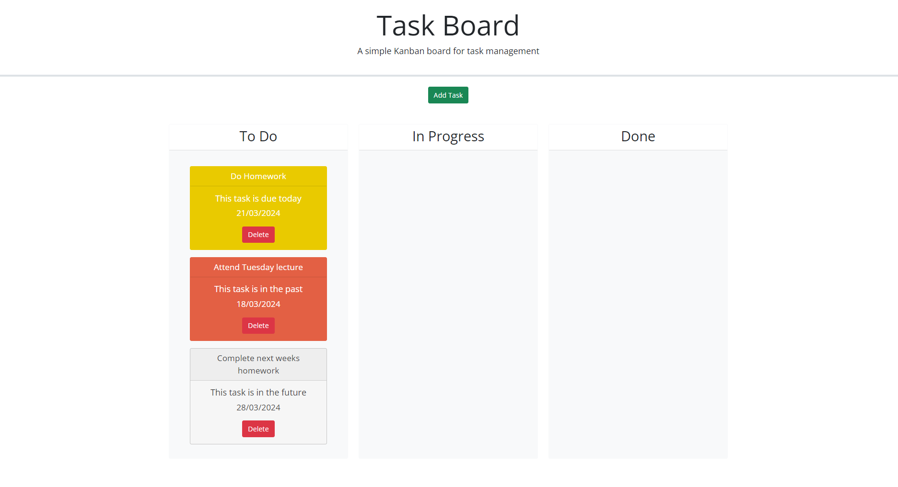
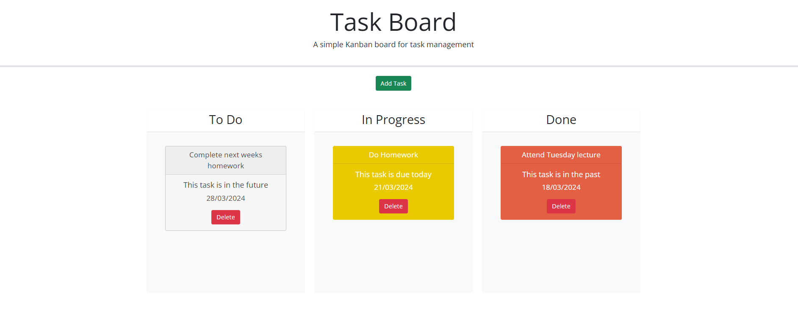
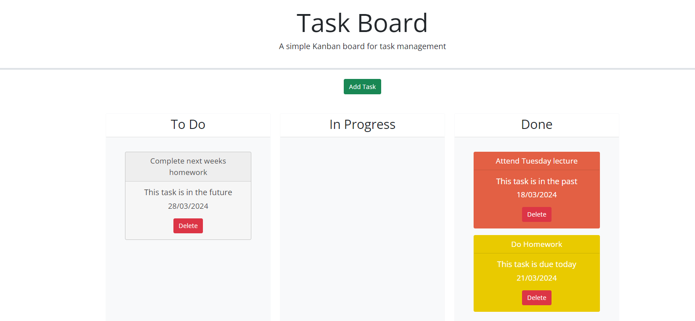

# Task Board

> A one page website where users can add tasks to a kanban board for task management
> Live demo [_here_](https://gaylemcclure.github.io/task-board/).

## Table of Contents
* [General Info](#general-information)
* [Technologies Used](#technologies-used)
* [Features](#features)
* [Screenshots](#screenshots)
* [Usage](#usage)
* [Contact](#contact)

## General Information
This task board can be used to create and keep track of tasks and their progress. With the data being saved in local storage, you can add tasks, refresh/close the page and when you come back your tasks will be in the same place. 

## Technologies Used
- HTML
- CSS
- Javascript
- jQuery
- jQuery UI
- Bootstrap

## Features
List the ready features here:
- Add Task modal popup using Bootstrap
- Modal fields include title, date, description and button
- Date field uses a jQuery UI datepicker 
- Clicking Add Task will;
   - add a timestamp id to the task
   - add a status to place it in the To Do column
   - create a card to show on the ui
   - save the task to local storage array
   - compare the due date with todays date and add appropiate class/styling
- A task card will appear on the todo column
- Can add multiple tasks
- Can click on the task and drag it to another column
- When refreshing, the tasks will remain in their new columns.
- Can delete a task, stays deleted once refreshed
  Delete removes it from local storage as well. 

## Screenshots

## Usage
1. Click 'Add Task' button
2. Input task title
3. Input due date
4. Input description
5. Click Add task button
6. Modal closes and task appears in To Do column
7. Can click and drag the task to In Progress column
8. Refreshing the page - task remains in the In Progress column
9. Click delete button on task
10. Task will be deleted from the page
11. Refreshing the page - task is deleted from local storage. 

## Contact
Created by Gayle McClure.

